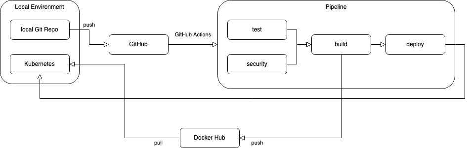

# Test Devops NodeJs - Arturo Delgado

Repositorio de desarrolo de la prueba técnica para DevOps. Está desarrollado con la [demo de Node.js](https://bitbucket.org/devsu/demo-devops-nodejs/src/master/)

## Arquitectura general

Se desplego la aplicación en un entorno local con [Docker Desktop](https://www.docker.com/products/docker-desktop/) y su standalone [Kubernetes](https://docs.docker.com/desktop/kubernetes/) por razones de costos. También se utiliza el operator de Kubernteste [Sealed Secrets](https://github.com/bitnami-labs/sealed-secrets) para manejar los secretos en la aplicación de forma segura, [ngrok](https://ngrok.com/) para exponer el control plane [kube-apiserver](https://kubernetes.io/docs/concepts/overview/components/#kube-apiserver) de Kuberntes, hacer el template de [Helm](https://helm.sh/) y aplicarlo desde GitHub Actions hacia el entorno local.

## Seguridad

Existen 2 puntos importantes de seguridad en el trabajo desarrollado.

### 1. Job de seguridad

Los análisis de seguridad en el job security se realizan con el tool [Snyk](https://snyk.io/), usando sus imagenes oficiales para los steps, y se hacen 3 pasos:

1. SAST con severidad total, haciendo el salto del step si falla. Ellos recomiendan usar CSRF por ejemplo, entonces para no implementar esa mejora se salta el paso así falle. Se eliminó el header [X-Powered-By](https://github.com/ajdelgados/test-devsu-node/blob/master/index.js#L6) por esas [recomendaciones](https://github.com/ajdelgados/test-devsu-node/actions/runs/5566991700/jobs/10168536066).
2. SAST con severidad alta. El step fallara si consigue un problema con severidad alta.
3. Chequeo de vulnerabilidades de los paquetes open source usados en el proyecto.

### 2. Uso de Sealed Secrets

El uso de Sealed Secret permite colocar los secretos en código de los manifiestos de Kubernetes. Se instaló en operador en el cluster y al hacer apply de los manifiestos despliega los secretos en el namespace de destino, sin dejar expuesto el valor del secreto en el repositorio usando claves asimétricas para encriptar el valor.

## Test

El job hace los test unitarios, coverage y static code analysis con [Jest](https://jestjs.io/) y [ESLint](https://eslint.org/). Jest se encontraba en el proyecto con 3 test unitarios, se habilitó el coverage y se realizó la configuración de los umbrales de covertura al 100%. Se implementarón 8 test extras para llegar al 100% de los umbrales. ESLint se instaló con la guia de estilo base de Airbnb.

## Docker / Build and Push

[Docker Hub](https://hub.docker.com/) se usa como container registry y se crea el Dockerfile con el .dockerignore. En el Dockerfile se usa la imagen Alpine y se instalan solo las dependencias para producción haciendo la imagen lo más liviana posible. También se configura el usuario node, para no usar el usuario root y si el container se encuantra vulnerable, no exista riesgo es escalamiento de privilegios.

## Deploy

Helm es el template manager para deplegar en Kubernetes en el proyecto, se creo el directorio helm dentro del repositorio con las configuraciones básicas en el values.yaml. Se usó ngrok para exponer el kube-apiserver del local.

## Branch strategy

[Trunk Based Development](https://trunkbaseddevelopment.com/) es el branch strategy en mente para crear los pipelines, se ejecuta un pipeline en el merges request donde se ejecutan los jobs de test y security. Al aprobar y hacer el merge, se ejecuta los jobs de test, security, build y deploy.
